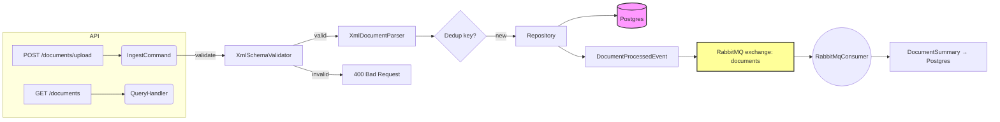

# Arquitetura do Backend para Documentos Fiscais Brasileiros

Este documento descreve a arquitetura de um backend ASP.NET Core desenvolvido para receber, armazenar e processar documentos fiscais XML brasileiros (NFe, CTe, NFSe) com padrões orientados a eventos e infraestrutura resiliente.

## Stack Tecnológica

| Componente | Biblioteca / Versão |
|---|---|
| Runtime | .NET 10 |
| Framework web | ASP.NET Core 10 |
| ORM | EF Core 9.0.3 |
| Driver de banco | Npgsql.EntityFrameworkCore.PostgreSQL 9.0.3 |
| Cliente de mensageria | RabbitMQ.Client 6.8.1 |
| Resiliência | Polly 8.2.0 |
| Mediador | MediatR 11.1.0 |
| Validação | FluentValidation 11.3.1 |
| Documentação da API | Swashbuckle.AspNetCore 10.1.4 |

---

## 1. Estilo Arquitetural Recomendado

**Arquitetura Clean/Onion com influência de Vertical Slices**

- A separação de responsabilidades mantém a API, a lógica de negócio e a infraestrutura independentes entre si.
- Os slices verticais agrupam funcionalidades por caso de uso e simplificam o pipeline de requisição–handler–validação.
- A inversão de dependência permite trocar provedores de banco de dados, brokers de mensagens ou camadas HTTP sem alterar o núcleo da aplicação.

## 2. Visão Geral da Arquitetura

```
                      ┌─────────────────────┐
                      │   ASP.NET Core      │
                      │   Web API + Swagger │
                      └─────────┬───────────┘
                                │
        ┌───────────────────────┴───────────────────────┐
        │   Vertical slices / Controllers/Handlers      │
        │   (Requests, Commands, Queries via MediatR)   │
        └───────────────────────┬───────────────────────┘
                                │
            ┌───────────────────┴───────────────────┐
            │   Domain / Application Core (entities,│
            │   interfaces, CQRS contracts, events) │
            └───────────────────┬───────────────────┘
                                │
          ┌─────────────────────┴─────────────────────┐
          │   Infrastructure                            │
          │   - Persistence (PostgreSQL)                │
          │   - Messaging (RabbitMQ)                    │
          │   - XML parser                              │
          │   - Idempotency store (same DB)             │
          └─────────────────────┬─────────────────────┘
                                │
        ┌───────────────────────┴───────────────────────┐
        │   Sistemas externos / clientes               │
        │   - Produtores de documentos fiscais XML     │
        │   - Consumidores inscritos em eventos Rabbit │
        │   - Equipes de operação (Swagger / REST)     │
        └───────────────────────────────────────────────┘
```


## 3. Componentes Principais

1. **Camada de API**
   - Controllers com roteamento MVC.
   - Geração de Swagger/OpenAPI (Swashbuckle 10.x).

2. **Camada de Aplicação**
   - Commands/Queries despachados via MediatR.
   - Validadores (FluentValidation).
   - Serviços de domínio para normalização de XML e construção de eventos.
   - `DocumentProcessedEvent` publicado no RabbitMQ após a ingestão.

3. **Camada de Domínio**
   - Entidades de documentos fiscais.
   - Interfaces para repositórios e publicadores de mensagens.

4. **Camada de Infraestrutura**
   - Persistência: EF Core com PostgreSQL (Npgsql).
   - Barramento de mensagens: wrapper do cliente RabbitMQ com resiliência via Polly.
   - Processador XML: `XmlDocumentParser` usando `System.Xml.XmlReader`; suporta NFe, CTe e NFSe, incluindo remoção de preâmbulos inválidos.
   - Armazenamento de idempotência: tabela `DocumentKeys` que registra o hash/chave de cada documento.

5. **Testes**
   - Testes unitários para handlers e serviços (NUnit + Moq + FluentAssertions).
   - Testes de integração com contêineres de PostgreSQL e RabbitMQ (Testcontainers).

## 4. Escolha e Justificativa do Banco de Dados

**PostgreSQL** (em vez de MongoDB)

- As consultas são relacionais (número de nota, intervalo de datas, status).
- Transações ACID garantem consistência entre o documento armazenado e os eventos gerados.
- Suporte maduro para .NET (EF Core, Npgsql) e fácil execução em contêineres de teste.

## 5. Explicação do Fluxo Orientado a Eventos

1. **Endpoint de ingestão** (`POST /documents/upload` com payload XML multipart)
   - O controller encaminha para `IngestDocumentCommand`.

2. **Handler**
   - Faz o parse e valida o XML; calcula a chave de deduplicação.
   - Chama o repositório com `AddIfNotExistsAsync(key, entity)` dentro de uma transação.
   - Define o `Status` inicial como `"Received"`.

3. **Publicação**
   - Após a inserção, cria o `DocumentProcessedEvent`.
   - Publica o evento na exchange fanout `documents` do RabbitMQ.
   - O evento contém metadados (id, tipo, CNPJ, estado, data de emissão, timestamp).

4. **Consumidores**
   - O serviço em segundo plano `RabbitMqConsumer` assina a fila `documents.processed`.
   - Utiliza acknowledgements e a exchange dead-letter `documents.dlx` para garantir confiabilidade.
   - Em caso de sucesso: persiste um registro `DocumentSummary` para projeções de consulta rápida.

5. **Consultas e Gestão**
   - Endpoints GET/PUT/DELETE para documentos.

## 6. Estrutura de Pastas

```
/src
  /Api                    ← Projeto de host web
    Program.cs
    /Controllers
      DocumentsController.cs
    /Models
      DocumentDto.cs
      PagedResultDto.cs
      UpdateDocumentRequest.cs
      UploadDocumentRequest.cs
    /Validators
      UpdateDocumentRequestValidator.cs

  /Application            ← Camada de aplicação / casos de uso
    /Documents
      /IngestDocument
        IngestDocumentCommand.cs
        IngestDocumentHandler.cs
        IngestDocumentValidator.cs
      /Commands
        DeleteDocumentCommand.cs
        DeleteDocumentHandler.cs
        UpdateDocumentCommand.cs
        UpdateDocumentHandler.cs
      /Queries
        DocumentListQuery.cs
        DocumentListHandler.cs
        DocumentSummaryDto.cs
        GetDocumentByIdQuery.cs
        GetDocumentByIdHandler.cs
    /Common
      /Exceptions
        XmlValidationException.cs
      /Interfaces
        IEventPublisher.cs
        IFiscalDocumentRepository.cs
        IDocumentSummaryRepository.cs
        IXmlDocumentParser.cs
        IXmlSchemaValidator.cs
      /Models
        DocumentFilter.cs
        PaginatedResult.cs
    /Events
      DocumentProcessedEvent.cs

  /Domain
    /Entities
      FiscalDocument.cs
      DocumentKey.cs
      DocumentSummary.cs
      ProcessingEvent.cs

  /Infrastructure
    /Configuration
      RabbitMqOptions.cs
    /Messaging
      RabbitMqPublisher.cs
      RabbitMqConsumer.cs
    /Persistence
      AppDbContext.cs
      AppDbContextFactory.cs
      FiscalDocumentRepository.cs
      DocumentSummaryRepository.cs
      /Migrations
        ...
    /HealthChecks
      PostgreSqlHealthCheck.cs
      RabbitMqHealthCheck.cs
    /Xml
      XmlDocumentParser.cs
      XmlSchemaValidator.cs

/tests
  /Unit
    /Application/Documents
      IngestDocumentHandlerTests.cs
    /Infrastructure/Xml
      XmlDocumentParserTests.cs
    /Infrastructure/Persistence
      IdempotencyTests.cs
  /Integration
    IntegrationTestFactory.cs
    DocumentUploadTests.cs
    /Fixtures
      DatabaseFixture.cs
      RabbitMqFixture.cs

/scripts
  setup-local-macos.sh
  setup-local-linux.sh
  setup-local-windows.ps1
  setup.sh
  init-db.sql
```

## 7. Principais Padrões de Projeto Utilizados

- **Repository**: abstração sobre EF Core/Npgsql.
- **CQRS**: handlers separados para comandos e consultas.
- **Mediator**: MediatR para despacho de commands/events.
- **Pipeline de comportamentos**: FluentValidation integrado ao pipeline do MediatR para validação transversal.
- **Factory**: `AppDbContextFactory` para suporte às ferramentas de design-time do EF.
- **Modelo de filtro**: `DocumentFilter` + `PaginatedResult<T>` para filtragem de consultas nos repositórios.

## 8. Implementação de Idempotência

- **Chave de idempotência**: atributo `chave` / `Id` do documento fiscal extraído do XML, ou SHA-256 do conteúdo bruto quando ausente.
- **Tabela de idempotência** (`DocumentKeys`) com `KeyHash` como PK e `DocumentId` como FK.
- A verificação e inserção são executadas dentro de uma transação.
- O cliente pode fornecer a chave pelo header `Idempotency-Key`.

## 9. Resiliência para RabbitMQ

- Recuperação automática de conexão e de rede via `AutomaticRecoveryEnabled` na connection factory.
- Retry com backoff exponencial via Polly tanto para publicação quanto para consumo.
- Mensagens persistentes (delivery mode 2).
- Exchange dead-letter `documents.dlx` configurada via argumento de fila `x-dead-letter-exchange`.
- Encerramento gracioso com fechamento de canais e conexões no `Dispose`.

## Diagrama de Resumo



> O consumidor é executado como `BackgroundService` no mesmo processo da API.

---

## Mensageria Orientada a Eventos

Ao ingerir um documento fiscal, a aplicação publica um `DocumentProcessedEvent` no RabbitMQ. A mensagem carrega o identificador do documento, o tipo, o CNPJ do emissor, o estado, a data de emissão e um timestamp.

### Contrato do evento
```csharp
public class DocumentProcessedEvent
{
    [JsonPropertyName("documentId")]
    public Guid DocumentId { get; set; }
    [JsonPropertyName("documentType")]
    public string DocumentType { get; set; }
    [JsonPropertyName("cnpj")]
    public string Cnpj { get; set; }
    [JsonPropertyName("issueDate")]
    public DateTime IssueDate { get; set; }
    [JsonPropertyName("processedAt")]
    public DateTime ProcessedAt { get; set; }
    [JsonPropertyName("state")]
    public string State { get; set; }
}
```

### Publicador
- `RabbitMqPublisher` implementa `IEventPublisher`.
- Configurado com recuperação automática e retry com backoff exponencial via Polly.
- Declara uma exchange fanout durável `documents` e a fila `documents.processed` vinculada a ela.
- Envia mensagens JSON persistentes; falhas são retentadas até o limite de `RetryCount`.
- Mensagens que esgotam as tentativas são encaminhadas para a exchange dead-letter `documents.dlx`.

### Consumidor
- `RabbitMqConsumer` é um `BackgroundService` que assina a fila `documents.processed`.
- Utiliza `AsyncEventingBasicConsumer` com `BasicQos(1)` para processar uma mensagem por vez.
- Ao receber, desserializa o evento e persiste um `DocumentSummary` via `IDocumentSummaryRepository`.
- A política de retry do Polly envolve o handler com backoff exponencial.
- Se todas as tentativas falharem, a mensagem recebe `BasicNack` sem requeue — o RabbitMQ a encaminha para `documents.dlx`.

**Ação downstream**: o consumidor grava um registro enxuto de `DocumentSummary` para projeções de consulta rápida.

### Estratégia de confiabilidade
1. **Recuperação de rede**: `AutomaticRecoveryEnabled = true`, `NetworkRecoveryInterval = 10s`.
2. **Retentativas**: tanto o publicador quanto o consumidor utilizam backoff exponencial via Polly (`RetryCount`, `RetryInitialDelayMs`).
3. **Dead-lettering**: argumento de fila `x-dead-letter-exchange`; mensagens persistentes + `BasicNack` explícito arquivam as falhas.
4. **Logs**: exceções registradas em Warning/Error com contexto completo.

---

## Endpoints da API REST

Todos os endpoints estão sob `/documents`.

| Método | Caminho | Descrição |
|--------|---------|-----------|
| POST   | `/documents/upload` | Faz o upload de um arquivo XML; retorna `201` com o novo id. Suporta o header `Idempotency-Key`. |
| GET    | `/documents` | Retorna lista paginada; suporta filtros `page`, `pageSize`, `cnpj`, `uf`, `fromDate`, `toDate`. |
| GET    | `/documents/{id}` | Busca um único documento (retorna o DTO completo incluindo o XML bruto). |
| PUT    | `/documents/{id}` | Atualiza metadados (`State`, `Status`). |
| DELETE | `/documents/{id}` | Remove o documento permanentemente. |

### DTOs

- `DocumentDto` — metadados completos do documento + XML bruto.
- `PagedResultDto<T>` — envelope de paginação genérico (`Items`, `Page`, `PageSize`, `TotalCount`).
- `UpdateDocumentRequest` — `State` (máx. 2 caracteres) e/ou `Status` (máx. 50 caracteres), validado por FluentValidation.
- `UploadDocumentRequest` — encapsula `IFormFile File` para upload multipart.

### Swagger

Habilitado com Swashbuckle 10.x; disponível em `http://localhost:5000/swagger`.

---

## Configuração

### appsettings.json
```json
{
  "ConnectionStrings": {
    "DefaultConnection": "Host=localhost;Port=5432;Database=s13g;Username=postgres;Password=postgres"
  },
  "RabbitMq": {
    "HostName": "localhost",
    "UserName": "guest",
    "Password": "guest",
    "VirtualHost": "/",
    "ExchangeName": "documents",
    "QueueName": "documents.processed",
    "DeadLetterExchange": "documents.dlx",
    "RetryCount": 5,
    "RetryInitialDelayMs": 500
  }
}
```

A string de conexão respeita as variáveis de ambiente `DB_USER` e `DB_PASS` (sobrescritas em `Program.cs` para desenvolvimento local).

### Injeção de dependências (Program.cs)
```csharp
builder.Services.Configure<RabbitMqOptions>(builder.Configuration.GetSection("RabbitMq"));
builder.Services.AddSingleton<RabbitMqPublisher>();
builder.Services.AddSingleton<IEventPublisher>(sp => sp.GetRequiredService<RabbitMqPublisher>());
builder.Services.AddHostedService<RabbitMqConsumer>();
builder.Services.AddScoped<IFiscalDocumentRepository, FiscalDocumentRepository>();
builder.Services.AddScoped<IDocumentSummaryRepository, DocumentSummaryRepository>();
builder.Services.AddScoped<IXmlDocumentParser, XmlDocumentParser>();
builder.Services.AddSingleton<IXmlSchemaValidator, XmlSchemaValidator>();
builder.Services.AddHealthChecks()
    .AddCheck<PostgreSqlHealthCheck>("postgresql")
    .AddCheck<RabbitMqHealthCheck>("rabbitmq");
```

---

## Modelo de Domínio e Persistência

### 1. Entidades de Domínio

- **FiscalDocument**: agregado raiz. Contém a chave do documento (chave fiscal), tipo, CNPJ do emissor/destinatário, estado, status, valor total e XML bruto.
- **DocumentKey**: registro de idempotência — armazena o hash SHA-256 ou a chave fiscal com FK para `FiscalDocument`.
- **DocumentSummary**: modelo de leitura desnormalizado, gravado pelo consumidor para projeções de consulta rápida.
- **ProcessingEvent**: registro de auditoria (reservado para uso futuro).

Relacionamentos: `FiscalDocument` 1-para-1 com `DocumentKey`; `FiscalDocument` 1-para-muitos com `ProcessingEvent`.

### 2. Schema do Banco de Dados (gerado pelo EF Core — colunas em PascalCase via Npgsql)

```sql
-- Aplicado via: dotnet ef database update

CREATE TABLE "FiscalDocuments" (
    "Id"            uuid        NOT NULL PRIMARY KEY,
    "DocumentKey"   text        NOT NULL,
    "Type"          text        NOT NULL,      -- "NFe" | "CTe" | "NFSe"
    "IssuerCnpj"    text        NOT NULL,
    "RecipientCnpj" text        NOT NULL,      -- empty string for foreign recipients
    "IssueDate"     timestamptz NOT NULL,
    "State"         text        NOT NULL,      -- UF code, e.g. "SP"
    "Status"        text        NOT NULL,      -- e.g. "Received"
    "TotalValue"    numeric     NOT NULL,
    "RawXml"        text        NOT NULL
);

CREATE TABLE "DocumentKeys" (
    "KeyHash"    character varying(64) NOT NULL PRIMARY KEY,
    "DocumentId" uuid                  NOT NULL UNIQUE REFERENCES "FiscalDocuments"("Id") ON DELETE CASCADE,
    "CreatedAt"  timestamptz           NOT NULL
);
CREATE UNIQUE INDEX ON "DocumentKeys"("KeyHash");
CREATE UNIQUE INDEX ON "DocumentKeys"("DocumentId");

CREATE TABLE "ProcessingEvents" (
    "Id"         bigint      NOT NULL GENERATED BY DEFAULT AS IDENTITY PRIMARY KEY,
    "DocumentId" uuid        NOT NULL REFERENCES "FiscalDocuments"("Id") ON DELETE CASCADE,
    "EventType"  text        NOT NULL,
    "OccurredAt" timestamptz NOT NULL,
    "Payload"    text        NOT NULL
);
CREATE INDEX ON "ProcessingEvents"("DocumentId");

CREATE TABLE "DocumentSummaries" (
    "Id"          uuid        NOT NULL PRIMARY KEY,
    "DocumentId"  uuid        NOT NULL UNIQUE,
    "Type"        text        NOT NULL,
    "IssuerCnpj"  text        NOT NULL,
    "State"       text        NOT NULL,
    "IssueDate"   timestamptz NOT NULL,
    "TotalValue"  numeric     NOT NULL,
    "ProcessedAt" timestamptz NOT NULL
);
CREATE UNIQUE INDEX ON "DocumentSummaries"("DocumentId");
```

### 3. Modelos C# Reais

```csharp
public enum DocumentType { NFe, CTe, NFSe }

public class FiscalDocument
{
    public Guid Id { get; set; }
    public string DocumentKey { get; set; }   // fiscal chave or SHA-256 hash
    public DocumentType Type { get; set; }
    public string IssuerCnpj { get; set; }
    public string RecipientCnpj { get; set; } // empty string when recipient is foreign
    public DateTime IssueDate { get; set; }
    public string State { get; set; }         // UF code
    public decimal TotalValue { get; set; }
    public string Status { get; set; }        // e.g. "Received"
    public string RawXml { get; set; }

    public DocumentKey Key { get; set; }
    public List<ProcessingEvent> Events { get; set; } = new();
}

public class DocumentSummary
{
    public Guid Id { get; set; }
    public Guid DocumentId { get; set; }
    public DocumentType Type { get; set; }
    public string IssuerCnpj { get; set; }
    public string State { get; set; }
    public DateTime IssueDate { get; set; }
    public decimal TotalValue { get; set; }
    public DateTime ProcessedAt { get; set; }
}

public class ProcessingEvent
{
    public long Id { get; set; }
    public Guid DocumentId { get; set; }
    public FiscalDocument Document { get; set; }
    public string EventType { get; set; }
    public DateTime OccurredAt { get; set; }
    public string Payload { get; set; }   // JSON
}

public class DocumentKey
{
    public string KeyHash { get; set; }
    public Guid DocumentId { get; set; }
    public FiscalDocument Document { get; set; }
    public DateTime CreatedAt { get; set; }
}
```

### 4. Estratégia de Idempotência

- **Geração de chave**: utiliza a `chave` do documento fiscal extraída do atributo `Id` do XML (`infNFe`, `infCTe`, `infNFSe`), ou SHA-256 do conteúdo bruto quando ausente.
- A ingestão ocorre dentro de uma transação no banco: verificação de existência → inserção atômica do documento + chave.
- Chave fornecida pelo cliente aceita via header `Idempotency-Key`.

### 5. Escalabilidade e Justificativa de Performance

- **Schema normalizado** evita duplicação; o XML bruto é armazenado na tabela principal por simplicidade na escala atual.
- A PK da tabela de idempotência + FK única do documento oferecem verificações de existência em O(1) sob ingestão concorrente.
- `DocumentSummary` viabiliza consultas de listagem leves, sem precisar carregar os blobs de XML completos.
- O PostgreSQL suporta escalabilidade horizontal via réplicas de leitura e particionamento por data, caso o volume aumente.

---

## Estratégia de Testes

```
/tests
  /Unit          ← NUnit + Moq + FluentAssertions
  /Integration   ← Testcontainers (PostgreSQL + RabbitMQ)
```

### Testes unitários

- **XmlDocumentParserTests**: extração de campos (DocumentKey, CNPJ, State, IssueDate, TotalValue) para amostras de NFe, CTe e NFSe; remoção de preâmbulos inválidos; tratamento de destinatários estrangeiros.
- **IngestDocumentHandlerTests**: parser/repositório/publisher mockados — caminho feliz + idempotência.
- **IdempotencyTests**: provider in-memory do EF Core validando a rejeição de chaves duplicadas.

### Testes de integração

- O Testcontainers sobe instâncias reais de PostgreSQL e RabbitMQ a cada execução de testes.
- `DocumentUploadTests`: POST de XML → verifica `201`, confere linha no banco, verifica mensagem no RabbitMQ.
- `DatabaseFixture` / `RabbitMqFixture` gerenciam o ciclo de vida dos contêineres.

### Executando os testes

```bash
dotnet restore
dotnet test tests/Unit/UnitTests.csproj
dotnet test tests/Integration/IntegrationTests.csproj   # requires Docker
```

---

## Planejado / Ainda Não Implementado

| Funcionalidade | Observações |
|---|---|
| ~~Health checks~~ | Implementado — `GET /health` retorna JSON com os status dos serviços `postgresql` e `rabbitmq` |
| ~~Validação de schema XML~~ | Implementado — `XmlSchemaValidator` valida a boa formação do XML, o elemento raiz (NFe/CTe/NFSe) e a presença dos elementos obrigatórios `infNFe`/`infCTe`/`infNFSe`; retorna `400` com lista de erros em caso de falha |
| ~~Publisher confirms~~ | Implementado — `ConfirmSelect()` habilitado no canal; `WaitForConfirmsOrDie(5s)` chamado após cada `BasicPublish` |
| ~~Índices compostos no banco~~ | Implementado — índices em `IssuerCnpj`, `RecipientCnpj`, `State`, `IssueDate` adicionados na migration `AddQueryIndexes` |

---

Este documento reflete o estado da base de código a partir da migration `InitialCreate` (EF Core 9.0.3, .NET 10). Atualize este arquivo sempre que entidades, endpoints ou escolhas de infraestrutura forem alterados.
