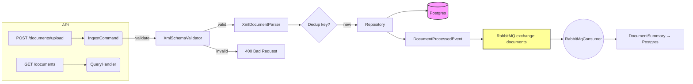

# Backend System Architecture for Brazilian Fiscal Documents

This document outlines the architecture of an ASP.NET Core backend designed to receive, store, and process Brazilian fiscal XML documents (NFe, CTe, NFSe) with event-driven patterns and resilient infrastructure.

## Technology Stack

| Component | Library / Version |
|---|---|
| Runtime | .NET 10 |
| Web framework | ASP.NET Core 10 |
| ORM | EF Core 9.0.3 |
| DB driver | Npgsql.EntityFrameworkCore.PostgreSQL 9.0.3 |
| Message broker client | RabbitMQ.Client 6.8.1 |
| Resilience | Polly 8.2.0 |
| Mediator | MediatR 11.1.0 |
| Validation | FluentValidation 11.3.1 |
| API documentation | Swashbuckle.AspNetCore 10.1.4 |

---

## 1. Recommended Architectural Style

**Clean/Onion Architecture with a Vertical-Slice flavour**

- Separation of concerns keeps API, business logic and infrastructure independent.
- Vertical slices group features by use-case and simplify the request–handler–validator pipeline.
- Dependency inversion allows swapping DB providers, message brokers, or HTTP layers without touching core logic.

## 2. High-Level System Architecture

```
                      ┌─────────────────────┐
                      │   ASP.NET Core      │
                      │   Web API + Swagger │
                      └─────────┬───────────┘
                                │
        ┌───────────────────────┴───────────────────────┐
        │   Vertical slices / Controllers/Handlers      │
        │   (Requests, Commands, Queries via MediatR)   │
        └───────────────────────┬───────────────────────┘
                                │
            ┌───────────────────┴───────────────────┐
            │   Domain / Application Core (entities,│
            │   interfaces, CQRS contracts, events) │
            └───────────────────┬───────────────────┘
                                │
          ┌─────────────────────┴─────────────────────┐
          │   Infrastructure                            │
          │   - Persistence (PostgreSQL)                │
          │   - Messaging (RabbitMQ)                    │
          │   - XML parser                              │
          │   - Idempotency store (same DB)             │
          └─────────────────────┬─────────────────────┘
                                │
        ┌───────────────────────┴───────────────────────┐
        │   External systems / clients                 │
        │   - Producers of fiscal XML documents        │
        │   - Consumers subscribed to Rabbit events    │
        │   - Operations teams (Swagger / REST)        │
        └───────────────────────────────────────────────┘
```


## 3. Main Components

1. **API layer**
   - Controllers with MVC routing.
   - Swagger/OpenAPI generation (Swashbuckle 10.x).

2. **Application layer**
   - Commands/Queries handled via MediatR.
   - Validators (FluentValidation).
   - Domain services for XML normalization, event construction.
   - `DocumentProcessedEvent` published to RabbitMQ after ingestion.

3. **Domain layer**
   - Fiscal document entities.
   - Interfaces for repositories & message publishers.

4. **Infrastructure layer**
   - Persistence: EF Core with PostgreSQL (Npgsql).
   - Message bus: RabbitMQ client wrapper with resilience (Polly).
   - XML processor: `XmlDocumentParser` using `System.Xml.XmlReader`; supports NFe, CTe, NFSe including invalid preamble stripping.
   - Idempotency store: `DocumentKeys` table recording document hash/key.

5. **Tests**
   - Unit tests for handlers and services (NUnit + Moq + FluentAssertions).
   - Integration tests with PostgreSQL and RabbitMQ containers (Testcontainers).

## 4. Database Choice and Justification

**PostgreSQL** (vs MongoDB)

- Queries are relational (invoice number, date-range, status).
- ACID transactions ensure consistency between stored document and events.
- Mature .NET support (EF Core, Npgsql) and simple to run in test containers.

## 5. Event-Driven Flow Explanation

1. **Ingestion endpoint** (`POST /documents/upload` with multipart XML payload)
   - Controller forwards to `IngestDocumentCommand`.

2. **Handler**
   - Parse and validate XML; compute dedup key.
   - Repository call `AddIfNotExistsAsync(key, entity)` with transaction.
   - Sets initial `Status = "Received"`.

3. **Publishing**
   - On insert, create `DocumentProcessedEvent`.
   - Publish event to RabbitMQ fanout exchange `documents`.
   - Event contains metadata (id, type, cnpj, state, issue date, timestamp).

4. **Consumers**
   - `RabbitMqConsumer` background service subscribes to queue `documents.processed`.
   - Uses acknowledgements and dead-letter exchange `documents.dlx` for reliability.
   - On success: writes a `DocumentSummary` record for fast query projections.

5. **Queries & Management**
   - GET/PUT/DELETE endpoints for documents.

## 6. Folder Structure

```
/src
  /Api                    ← Web host project
    Program.cs
    /Controllers
      DocumentsController.cs
    /Models
      DocumentDto.cs
      PagedResultDto.cs
      UpdateDocumentRequest.cs
      UploadDocumentRequest.cs
    /Validators
      UpdateDocumentRequestValidator.cs

  /Application            ← application/use-case layer
    /Documents
      /IngestDocument
        IngestDocumentCommand.cs
        IngestDocumentHandler.cs
        IngestDocumentValidator.cs
      /Commands
        DeleteDocumentCommand.cs
        DeleteDocumentHandler.cs
        UpdateDocumentCommand.cs
        UpdateDocumentHandler.cs
      /Queries
        DocumentListQuery.cs
        DocumentListHandler.cs
        DocumentSummaryDto.cs
        GetDocumentByIdQuery.cs
        GetDocumentByIdHandler.cs
    /Common
      /Exceptions
        XmlValidationException.cs
      /Interfaces
        IEventPublisher.cs
        IFiscalDocumentRepository.cs
        IDocumentSummaryRepository.cs
        IXmlDocumentParser.cs
        IXmlSchemaValidator.cs
      /Models
        DocumentFilter.cs
        PaginatedResult.cs
    /Events
      DocumentProcessedEvent.cs

  /Domain
    /Entities
      FiscalDocument.cs
      DocumentKey.cs
      DocumentSummary.cs
      ProcessingEvent.cs

  /Infrastructure
    /Configuration
      RabbitMqOptions.cs
    /Messaging
      RabbitMqPublisher.cs
      RabbitMqConsumer.cs
    /Persistence
      AppDbContext.cs
      AppDbContextFactory.cs
      FiscalDocumentRepository.cs
      DocumentSummaryRepository.cs
      /Migrations
        ...
    /HealthChecks
      PostgreSqlHealthCheck.cs
      RabbitMqHealthCheck.cs
    /Xml
      XmlDocumentParser.cs
      XmlSchemaValidator.cs

/tests
  /Unit
    /Application/Documents
      IngestDocumentHandlerTests.cs
    /Infrastructure/Xml
      XmlDocumentParserTests.cs
    /Infrastructure/Persistence
      IdempotencyTests.cs
  /Integration
    IntegrationTestFactory.cs
    DocumentUploadTests.cs
    /Fixtures
      DatabaseFixture.cs
      RabbitMqFixture.cs

/scripts
  setup-local-macos.sh
  setup-local-linux.sh
  setup-local-windows.ps1
  setup.sh
  init-db.sql
```

## 7. Key Design Patterns Used

- **Repository**: abstraction over EF Core/Npgsql.
- **CQRS**: separate command and query handlers.
- **Mediator**: MediatR for dispatching commands/events.
- **Behaviour pipeline**: FluentValidation via MediatR pipeline for cross-cutting validation.
- **Factory**: `AppDbContextFactory` for design-time EF tooling.
- **Filter model**: `DocumentFilter` + `PaginatedResult<T>` for query filtering within repositories.

## 8. Idempotency Implementation

- **Idempotency key**: fiscal document `chave` / `Id` attribute extracted from XML, or SHA-256 of raw content when no key is present.
- **Idempotency table** (`DocumentKeys`) with `KeyHash` PK and `DocumentId` FK.
- Perform insert/check inside a transaction.
- Client may supply key via `Idempotency-Key` header.

## 9. Resilience for RabbitMQ

- Automatic recovery and network recovery on connection factory (`AutomaticRecoveryEnabled`).
- Polly exponential backoff retry around both publish and consume.
- Persistent messages (delivery mode 2).
- Dead-letter exchange `documents.dlx` configured via `x-dead-letter-exchange` queue argument.
- Graceful shutdown closing channels and connections in `Dispose`.

## Summary Diagram



> The consumer runs as a `BackgroundService` in the same process as the API.

---

## Event‑driven Messaging

When a fiscal document is ingested the application publishes a `DocumentProcessedEvent` to RabbitMQ. The message carries the document identifier, type, issuer CNPJ, state, issue date and a timestamp.

### Event contract
```csharp
public class DocumentProcessedEvent
{
    [JsonPropertyName("documentId")]
    public Guid DocumentId { get; set; }
    [JsonPropertyName("documentType")]
    public string DocumentType { get; set; }
    [JsonPropertyName("cnpj")]
    public string Cnpj { get; set; }
    [JsonPropertyName("issueDate")]
    public DateTime IssueDate { get; set; }
    [JsonPropertyName("processedAt")]
    public DateTime ProcessedAt { get; set; }
    [JsonPropertyName("state")]
    public string State { get; set; }
}
```

### Publisher
- `RabbitMqPublisher` implements `IEventPublisher`.
- Configured with automatic recovery and Polly exponential backoff retry.
- Declares a durable fanout exchange `documents` and queue `documents.processed` bound to it.
- Sends persistent JSON messages; failures retried up to `RetryCount`.
- Messages that exhaust retries are routed to dead-letter exchange `documents.dlx`.

### Consumer
- `RabbitMqConsumer` is a `BackgroundService` subscribing to `documents.processed`.
- Uses an `AsyncEventingBasicConsumer` with `BasicQos(1)` to process one message at a time.
- On receipt, deserializes the event and persists a `DocumentSummary` via `IDocumentSummaryRepository`.
- Polly retry policy wraps the handler with exponential backoff.
- If all retries fail the message is `BasicNack`ed without requeueing — RabbitMQ routes it to `documents.dlx`.

**Downstream action**: the consumer writes a thin `DocumentSummary` record for fast query projections.

### Reliability strategy
1. **Network recovery**: `AutomaticRecoveryEnabled = true`, `NetworkRecoveryInterval = 10s`.
2. **Retries**: both publisher and consumer use Polly exponential backoff (`RetryCount`, `RetryInitialDelayMs`).
3. **Dead-lettering**: `x-dead-letter-exchange` queue argument; persistent messages + explicit `BasicNack` archive failures.
4. **Logging**: exceptions logged at Warning/Error with full context.

---

## REST API Endpoints

All endpoints live under `/documents`.

| Method | Path | Description |
|--------|------|-------------|
| POST   | `/documents/upload` | Upload an XML file; returns `201` with new id. Supports `Idempotency-Key` header. |
| GET    | `/documents` | Returns paged list; supports `page`, `pageSize`, `cnpj`, `uf`, `fromDate`, `toDate` filters. |
| GET    | `/documents/{id}` | Fetch a single document (returns full DTO including raw XML). |
| PUT    | `/documents/{id}` | Update metadata (`State`, `Status`). |
| DELETE | `/documents/{id}` | Remove document permanently. |

### DTOs

- `DocumentDto` – full document metadata + raw XML.
- `PagedResultDto<T>` – generic pagination envelope (`Items`, `Page`, `PageSize`, `TotalCount`).
- `UpdateDocumentRequest` – `State` (max 2 chars) and/or `Status` (max 50 chars), validated by FluentValidation.
- `UploadDocumentRequest` – wraps `IFormFile File` for multipart upload.

### Swagger

Enabled with Swashbuckle 10.x; available at `http://localhost:5000/swagger`.

---

## Configuration

### appsettings.json
```json
{
  "ConnectionStrings": {
    "DefaultConnection": "Host=localhost;Port=5432;Database=s13g;Username=postgres;Password=postgres"
  },
  "RabbitMq": {
    "HostName": "localhost",
    "UserName": "guest",
    "Password": "guest",
    "VirtualHost": "/",
    "ExchangeName": "documents",
    "QueueName": "documents.processed",
    "DeadLetterExchange": "documents.dlx",
    "RetryCount": 5,
    "RetryInitialDelayMs": 500
  }
}
```

Connection string respects `DB_USER` and `DB_PASS` environment variables (overridden in `Program.cs` for local dev).

### Dependency injection (Program.cs)
```csharp
builder.Services.Configure<RabbitMqOptions>(builder.Configuration.GetSection("RabbitMq"));
builder.Services.AddSingleton<RabbitMqPublisher>();
builder.Services.AddSingleton<IEventPublisher>(sp => sp.GetRequiredService<RabbitMqPublisher>());
builder.Services.AddHostedService<RabbitMqConsumer>();
builder.Services.AddScoped<IFiscalDocumentRepository, FiscalDocumentRepository>();
builder.Services.AddScoped<IDocumentSummaryRepository, DocumentSummaryRepository>();
builder.Services.AddScoped<IXmlDocumentParser, XmlDocumentParser>();
builder.Services.AddSingleton<IXmlSchemaValidator, XmlSchemaValidator>();
builder.Services.AddHealthChecks()
    .AddCheck<PostgreSqlHealthCheck>("postgresql")
    .AddCheck<RabbitMqHealthCheck>("rabbitmq");
```

---

## Domain Model & Persistence

### 1. Domain Entities

- **FiscalDocument**: root aggregate. Contains document key (fiscal chave), type, issuer/recipient CNPJ, state, status, total value, and raw XML.
- **DocumentKey**: idempotency record — stores SHA-256 hash or fiscal chave with FK to `FiscalDocument`.
- **DocumentSummary**: denormalized read-model written by the consumer for fast query projections.
- **ProcessingEvent**: audit log record (reserved for future use).

Relationships: `FiscalDocument` 1‑to‑1 `DocumentKey`; `FiscalDocument` 1‑to‑many `ProcessingEvent`.

### 2. Database Schema (EF Core generated — Npgsql PascalCase columns)

```sql
-- Applied via: dotnet ef database update

CREATE TABLE "FiscalDocuments" (
    "Id"            uuid        NOT NULL PRIMARY KEY,
    "DocumentKey"   text        NOT NULL,
    "Type"          text        NOT NULL,      -- "NFe" | "CTe" | "NFSe"
    "IssuerCnpj"    text        NOT NULL,
    "RecipientCnpj" text        NOT NULL,      -- empty string for foreign recipients
    "IssueDate"     timestamptz NOT NULL,
    "State"         text        NOT NULL,      -- UF code, e.g. "SP"
    "Status"        text        NOT NULL,      -- e.g. "Received"
    "TotalValue"    numeric     NOT NULL,
    "RawXml"        text        NOT NULL
);

CREATE TABLE "DocumentKeys" (
    "KeyHash"    character varying(64) NOT NULL PRIMARY KEY,
    "DocumentId" uuid                  NOT NULL UNIQUE REFERENCES "FiscalDocuments"("Id") ON DELETE CASCADE,
    "CreatedAt"  timestamptz           NOT NULL
);
CREATE UNIQUE INDEX ON "DocumentKeys"("KeyHash");
CREATE UNIQUE INDEX ON "DocumentKeys"("DocumentId");

CREATE TABLE "ProcessingEvents" (
    "Id"         bigint      NOT NULL GENERATED BY DEFAULT AS IDENTITY PRIMARY KEY,
    "DocumentId" uuid        NOT NULL REFERENCES "FiscalDocuments"("Id") ON DELETE CASCADE,
    "EventType"  text        NOT NULL,
    "OccurredAt" timestamptz NOT NULL,
    "Payload"    text        NOT NULL
);
CREATE INDEX ON "ProcessingEvents"("DocumentId");

CREATE TABLE "DocumentSummaries" (
    "Id"          uuid        NOT NULL PRIMARY KEY,
    "DocumentId"  uuid        NOT NULL UNIQUE,
    "Type"        text        NOT NULL,
    "IssuerCnpj"  text        NOT NULL,
    "State"       text        NOT NULL,
    "IssueDate"   timestamptz NOT NULL,
    "TotalValue"  numeric     NOT NULL,
    "ProcessedAt" timestamptz NOT NULL
);
CREATE UNIQUE INDEX ON "DocumentSummaries"("DocumentId");
```

### 3. Actual C# Models

```csharp
public enum DocumentType { NFe, CTe, NFSe }

public class FiscalDocument
{
    public Guid Id { get; set; }
    public string DocumentKey { get; set; }   // fiscal chave or SHA-256 hash
    public DocumentType Type { get; set; }
    public string IssuerCnpj { get; set; }
    public string RecipientCnpj { get; set; } // empty string when recipient is foreign
    public DateTime IssueDate { get; set; }
    public string State { get; set; }         // UF code
    public decimal TotalValue { get; set; }
    public string Status { get; set; }        // e.g. "Received"
    public string RawXml { get; set; }

    public DocumentKey Key { get; set; }
    public List<ProcessingEvent> Events { get; set; } = new();
}

public class DocumentSummary
{
    public Guid Id { get; set; }
    public Guid DocumentId { get; set; }
    public DocumentType Type { get; set; }
    public string IssuerCnpj { get; set; }
    public string State { get; set; }
    public DateTime IssueDate { get; set; }
    public decimal TotalValue { get; set; }
    public DateTime ProcessedAt { get; set; }
}

public class ProcessingEvent
{
    public long Id { get; set; }
    public Guid DocumentId { get; set; }
    public FiscalDocument Document { get; set; }
    public string EventType { get; set; }
    public DateTime OccurredAt { get; set; }
    public string Payload { get; set; }   // JSON
}

public class DocumentKey
{
    public string KeyHash { get; set; }
    public Guid DocumentId { get; set; }
    public FiscalDocument Document { get; set; }
    public DateTime CreatedAt { get; set; }
}
```

### 4. Idempotency Strategy

- **Key generation**: use fiscal document `chave` extracted from XML `Id` attribute (`infNFe`, `infCTe`, `infNFSe`), or SHA-256 of raw content when absent.
- Ingestion runs inside a DB transaction: existence check → atomic insert of document + key.
- Client-supplied key accepted via `Idempotency-Key` header.

### 5. Scalability & Performance Rationale

- **Normalized schema** prevents duplication; raw XML stored in the main table for simplicity at current scale.
- **Idempotency table** PK + unique document FK provide O(1) existence checks under concurrent ingestion.
- `DocumentSummary` enables lightweight list queries without loading full XML blobs.
- PostgreSQL supports horizontal scaling via read replicas and date-based partitioning if volume grows.

---

## Testing Strategy

```
/tests
  /Unit          ← NUnit + Moq + FluentAssertions
  /Integration   ← Testcontainers (PostgreSQL + RabbitMQ)
```

### Unit tests

- **XmlDocumentParserTests**: field extraction (DocumentKey, CNPJ, State, IssueDate, TotalValue) for NFe, CTe, NFSe samples; invalid preamble stripping; foreign-recipient handling.
- **IngestDocumentHandlerTests**: mocked parser/repo/publisher — happy path + idempotency.
- **IdempotencyTests**: EF Core in-memory provider asserting duplicate key rejection.

### Integration tests

- Testcontainers spin up real PostgreSQL and RabbitMQ per test run.
- `DocumentUploadTests`: POST XML → assert `201`, verify DB row, verify RabbitMQ message.
- `DatabaseFixture` / `RabbitMqFixture` manage container lifecycle.

### Running the tests

```bash
dotnet restore
dotnet test tests/Unit/UnitTests.csproj
dotnet test tests/Integration/IntegrationTests.csproj   # requires Docker
```

---

## Planned / Not Yet Implemented

| Feature | Notes |
|---|---|
| ~~Health checks~~ | ✅ Implemented — `GET /health` returns JSON with `postgresql` and `rabbitmq` service statuses |
| ~~XML schema validation~~ | ✅ Implemented — `XmlSchemaValidator` validates well-formedness, root element (NFe/CTe/NFSe), and presence of required `infNFe`/`infCTe`/`infNFSe` element; returns `400` with error list on failure |
| ~~Publisher confirms~~ | ✅ Implemented — `ConfirmSelect()` enabled on channel; `WaitForConfirmsOrDie(5s)` called after each `BasicPublish` |
| ~~Composite DB indexes~~ | ✅ Implemented — indexes on `IssuerCnpj`, `RecipientCnpj`, `State`, `IssueDate` added in migration `AddQueryIndexes` |

---

This document reflects the codebase as of the `InitialCreate` migration (EF Core 9.0.3, .NET 10). Update this file whenever entities, endpoints, or infrastructure choices change.
